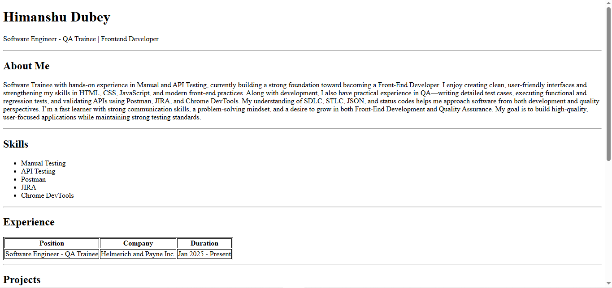
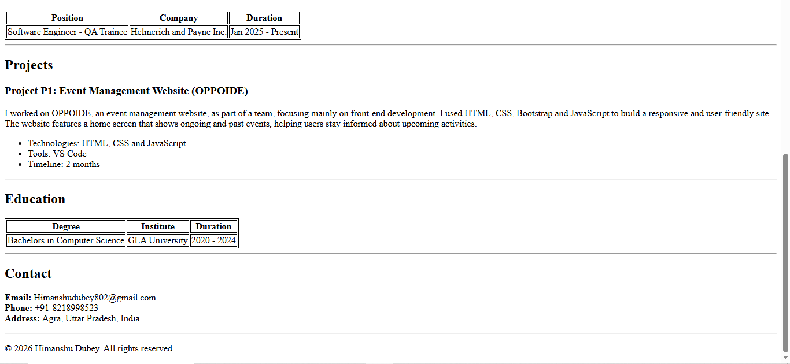

# Single Page Resume Website

## 📌 Project Description

This project is a **Single-Page Resume Website** built using only **HTML** as per assignment instructions.

The entire resume structure is created using basic HTML elements such as:

- Headings (`<h1>`, `<h2>`, `<h3>`)
- Paragraphs (`
`)
- Lists (`<ul>`, `<li>`)
- Tables (`<table>`, `<tr>`, `<th>`, `<td>`)
- Horizontal line (`
`)

The resume includes all required sections and follows a simple structured layout.

---

## 🧩 Sections Included

The resume contains the following sections:

- Header (Name & Title)
- About Me
- Skills List
- Experience Table
- Projects Section
- Education Table
- Contact Details

---

## 🛠️ Technologies Used

- HTML5
- Table Elements (`<table>`, `<tr>`, `<th>`, `<td>`)
- Inline CSS (only for table border)

---
## 🚀 How to Run the Project

1. Clone the repository:
git clone: https://github.com/Himanshu1128/SinglePageResume.git

2. Open the project folder.

3. Open the `Resume.html` file in any web browser.

No additional setup or installation is required.

---

## 📷 Output Preview

The screenshot image is placed in the root folder.

Displayed below:

 and 

---

## 🌐 Live Demo (If Hosted)

If deployed using GitHub Pages, add the link below:

Live Demo: https://himanshu1128.github.io/SinglePageResume/

---

## 📋 Assignment Requirements Fulfilled

- [x] Single-page resume website
- [x] Built using HTML
- [x] No external or internal CSS used
- [x] Inline CSS used only for table borders
- [x] Includes all required sections
- [x] Public GitHub repository
- [x] Screenshot added
- [x] Live deployment (optional)

---

## 👤 Author

Your Name : HIMANSHU DUBEY
Your Email : Himanshudubey802@gmail.com
GitHub Profile Link : https://github.com/Himanshu1128

